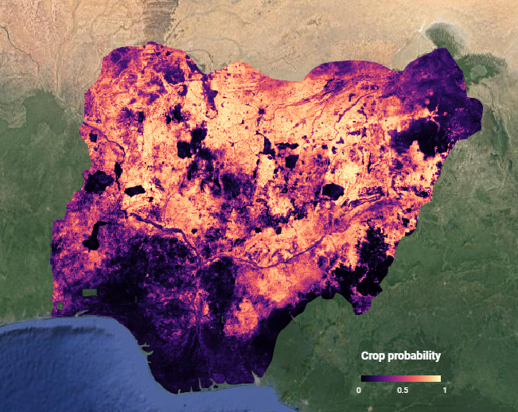
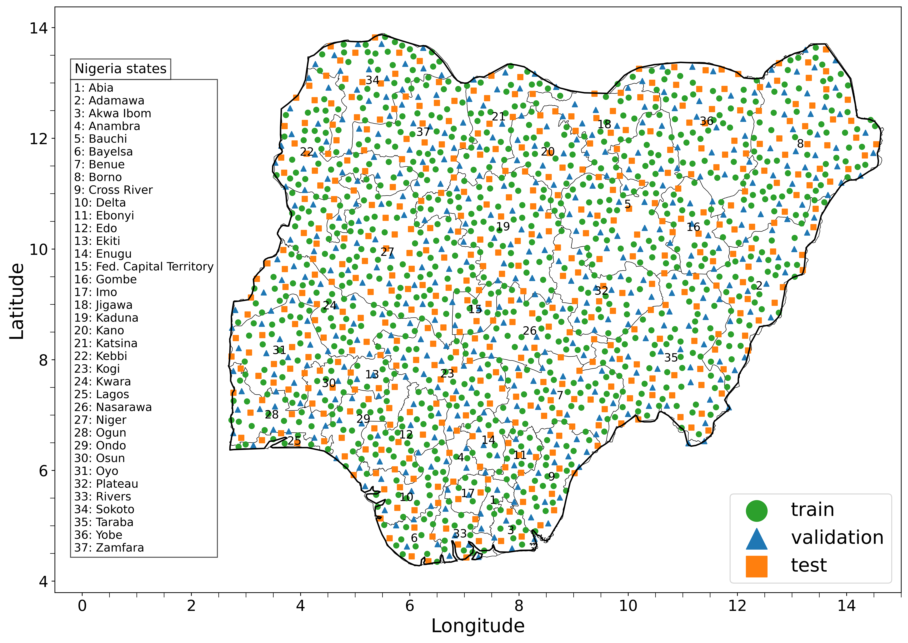

# :earth_africa: Nigeria Crop Mask :seedling:
This repository contains the code and data supporting [Gajardo et. al (2023)](https://arxiv.org/abs/2312.10872), for training a pixel-wise LSTM binary classifier to predict cropland vs non-cropland from remote sensing data and using it to generate two cropland maps for Nigeria for the year 2020. The code is largely based on the work of [Kerner et. al (2020)](https://arxiv.org/abs/2006.16866) from NASA Harvest, who build a similar cropland mask for Togo.

Links:
- :clapper:**[Demo:](https://joaquingajardocastillo.users.earthengine.app/view/nigeria-cropland-maps)** a Google Earth Engine (GEE) app to interactively visualize the output maps map and compare them to the ESA WorldCover 2020 land cover map, size-by-side.
- :pencil: **[Paper](https://arxiv.org/abs/2312.10872):** Gajardo et. al (2023), *Country-scale Cropland Mapping in Data-Scarce Settings Using Deep Learning: a Case Study of Nigeria.*
- :open_file_folder:**[New Nigeria cropland dataset:](https://drive.google.com/drive/folders/1rJhh-UMknwOH14O-RFWpNfIViveUgE_5?usp=drive_link)** Google Drive link with the new hand-labelled binary Nigeria cropland dataset (labelled by one expert via remote photointerpretation) and the respective `hd5f` data arrays.
- :eyes: **[Maps:](https://drive.google.com/drive/folders/10MO0rJZ66dHLTdHDP-kWi_Da8SpjDjNO?usp=sharing)** Google Drive link with the final cropland and cropland probability maps for Nigeria 2020.

<p align="center">
    
</p>

## :open_file_folder: Data
The data used to train the LSTM model combines a new hand-labelled [dataset]() of crop and non-crop labels distributed throughout Nigeria (figure below) with a subset of the [global Geowiki cropland dataset](https://doi.pangaea.de/10.1594/PANGAEA.873912) to predict the presence of cropland in a pixel time series. The pixels time series consists of 12 monthly composites of remote sensing data at 10 m resolution, including Sentinel-1 and Sentinel-2 satellite images, as well as meteorological and topographic data. The training and inference data is processed using the [CropHarvest Python package](https://github.com/nasaharvest/cropharvest).

<p align="center">
    
</p>

## :hammer: Setup
The code was developed and tested on a Linux-based workstation using Python 3.7. For setting up the environment, install [miniconda](https://docs.conda.io/projects/miniconda/en/latest/) or Anaconda, and you can create a new environment using the explicit environment yaml file we provide:
```bash
conda env create -f envs/env_gpu_explicit.yml
conda activate nigeria-crop-mask-gpu
```

If you run into package conflicts, you can try to install the dependencies manually:
```bash
conda env create -f envs/environment-gpu.yml # GPU environment
conda env create -f envs/environment.yml # CPU environment
```
### [Optional] Google Earth Engine (GEE)

We provide the labels in this repository [data/features/nigeria-cropharvest](data/features/nigeria-cropharvest/), as well as the respective data arrays in [Google Drive](https://drive.google.com/drive/folders/1rJhh-UMknwOH14O-RFWpNfIViveUgE_5?usp=drive_link), but if you want to create the dataset yourself or download the inference data (10TB of disk space!) you will need a [GEE account](https://code.earthengine.google.com/register). You can use it with your conda environment after authentication in the command line or in a Jupyter notebook:

```bash
earthengine authenticate # CL
"import ee; ee.Authenticate()" # in a Jupyter notebook
```

Note that GEE exports files to Google Drive by default (to the same google account used to sign up to GEE).
Running exports can be viewed (and individually cancelled) in the `Tabs` bar on the [GEE Code Editor](https://code.earthengine.google.com/).

## :computer: Code

The main entrypoints into the pipeline are the [scripts](scripts) and the [Jupyter notebooks](notebooks/). The main code is on the `src` folder, which provides the implementation of the model, data exporters, utilities, etc.

### Data preparation
You may directly download the data of the Nigeria dataset from the following [Google Drive link](https://drive.google.com/drive/folders/1rJhh-UMknwOH14O-RFWpNfIViveUgE_5?usp=drive_link), and put the contents in the [data/features/nigeria-cropharvest](data/features/nigeria-cropharvest/) folder. The Geowiki data will be automatically downloaded by the CropHarvest package the first time a model is trained.

**Optional:** If you want to re-create the dataset yourself, the main steps are exporting and engineering the features, which can be done using the following notebooks [13](notebooks/13_cropharvest_sentinel1.ipynb) and [14](notebooks/14_cropharvest_sentinel1_engineer_nigeria.ipynb).


### Training and testing
The script [scripts/models.py](scripts/models.py) is used to train models. The main results table of the paper can be reproduced using the following scripts, which run experiments with different training dataset configurations:

```bash
bash run_experiments.sh final lstm 64 1 0.2 2 100 False True False
python scrips/parse_results.py final lstm
```
For reproducing the results of the Random Forest and the global landcover map baselines, see notebooks [19](./notebooks/19_cropharvest_sentinel1_reimplementation%20RF_benchmark.ipynb) and [22](./notebooks/22_cropharvest_sentinel1_GEE_landcover_maps_benchmark.ipynb), respectively.


### Inference
For using a trained model for inference on satellite images, first download the satellite images of the region using the regional exporter from CropHarvest (see [notebook 16](notebooks/16_cropharvest_sentinel1_export_region_nigeria.ipynb)). Then run the following script (you will need to adjust the path to the model within the file).

```bash
python scripts/inference_nigeria.py
```
### Map creation
The final maps and the map figures of the paper are created using the following scripts.
```bash
python scripts/create_map.py
python scripts/create_figure_nigeria_map.py
```


## :pray: Acknowledgements
This work was largely based on the amazing work by [NASA Harvest](https://nasaharvest.org/) and their open-source software. In particular, we relied on [togo-crop-mask](https://github.com/nasaharvest/togo-crop-mask) paper and code for conceiving the idea and as an initial code template, and on the [CropHarvest](https://github.com/nasaharvest/cropharvest) package for the final version of our code.

## :bookmark_tabs: Citation

If you find our work useful, please cite our paper:
    
```bibtex
@misc{gajardo2023countryscale,
    title={Country-Scale Cropland Mapping in Data-Scarce Settings Using Deep Learning: A Case Study of Nigeria}, 
    author={Joaquin Gajardo and Michele Volpi and Daniel Onwude and Thijs Defraeye},
    year={2023},
    eprint={2312.10872},
    archivePrefix={arXiv},
    primaryClass={cs.CV}
}
```
